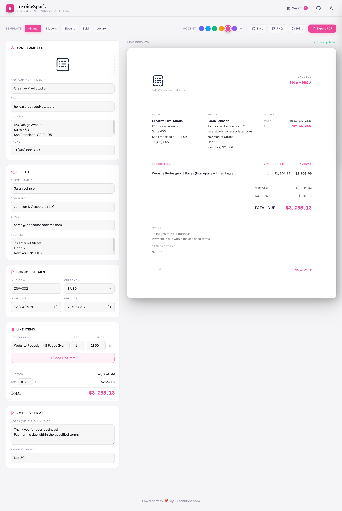

# ✦ InvoiceSpark

> **Professional Invoices That Impress** — The most beautiful, free invoice generator on the internet.



---
[🚀 **Live Demo**](https://icodingstack.github.io/invoicespark) 
• [📥 Download ZIP](https://github.com/ICodingStack/invoicespark/archive/refs/heads/main.zip)

## Features

- **5 Premium Templates** — Minimal, Modern, Elegant, Bold, Luxury
- **Live Preview** — See your invoice update in real-time as you type
- **Full Color Theming** — 6 accent color presets + custom color picker
- **Logo Upload** — Drag & drop or click to upload your company logo
- **PDF Export** — High-quality PDF via html2canvas + jsPDF
- **PNG Export** — Crystal-clear PNG download
- **Print Support** — Perfect print-ready formatting
- **Local Storage** — Save and reload up to 50 invoices in your browser
- **Dark/Light Mode** — Elegant toggle with smooth transitions
- **Keyboard Shortcuts** — `Cmd+S` to save, `Cmd+P` to print
- **Multi-Currency** — USD, EUR, GBP, JPY, CAD, AUD, MYR, SGD
- **Responsive** — Beautiful on desktop and mobile

---

## Quick Start

1. Clone or download this repository
2. Open `index.html` in any modern browser
3. No build step, no server, no dependencies to install

```bash
git clone https://github.com/yourusername/invoicespark.git
cd invoicespark
open index.html
```

---

## File Structure

```
invoicespark/
├── index.html              # Main application HTML
├── css/
│   └── style.css           # Premium CSS with CSS variables
├── js/
│   ├── main.js             # App controller & state management
│   ├── invoice-generator.js # 5 template renderers
│   ├── pdf-export.js       # PDF/PNG/Print export
│   └── utils.js            # Utility functions
├── assets/
│   └── icons/              # Optional icon assets
├── README.md
├── LICENSE
└── .gitignore
```

---

## Templates

| Template | Description |
|----------|-------------|
| **Minimal** | Pure white, generous spacing, thin lines |
| **Modern** | Coloured header band, bold numbers |
| **Elegant** | Framed with corner ornaments, editorial luxury |
| **Bold** | Dark sidebar, strong accent, maximum impact |
| **Luxury** | Warm gradient, ornate diamond dividers |

---

## Tech Stack

- **Vanilla JavaScript** (ES6+, no frameworks)
- **Tailwind CSS** via CDN
- **Google Fonts** — Playfair Display + DM Sans + DM Mono
- **jsPDF** + **html2canvas** for export
- Zero build tooling required

---

## Keyboard Shortcuts

| Shortcut | Action |
|----------|--------|
| `Cmd/Ctrl + S` | Save invoice |
| `Cmd/Ctrl + P` | Print invoice |
| `Escape` | Close drawer |

---

## License

MIT — free to use, modify, and distribute. See [LICENSE](LICENSE).

---

**Made with ❤️ by [BlackBirdo](https://NlackBirdo)**
